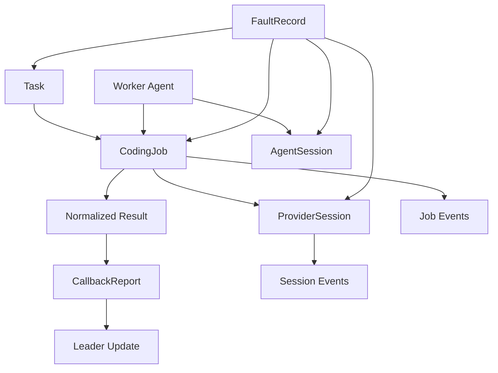
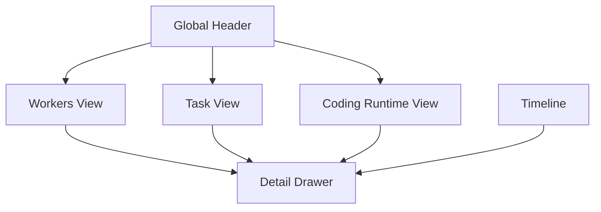

# Runtime Console Design for CLI + Web Board

**Date:** 2026-04-05
**Repository:** ClawTeam-OpenClaw
**Status:** Approved design spec for implementation
**Audience:** The coding agent implementing the next generation ClawTeam runtime console
**Primary Goal:** Deliver a professional, correct, trustworthy, observable, and controllable operator surface for team runtime, coding runtime, callback loops, and Claude/Codex session-aware execution.

---

## 1. Executive Summary

ClawTeam-OpenClaw now has a credible V1 coding callback runtime:

- durable coding jobs exist
- callback reports exist
- task metadata captures coding outcomes
- coding job faults can be surfaced
- job creation is atomic under concurrency
- CLI and board already expose a partial coding view

That is necessary, but not sufficient.

The current operator surface is still fragmented:

- CLI exposes job-level runtime but not a complete control surface
- Rich board and Web board are not yet aligned
- `task`, `job`, `agent session`, and `provider session` are not yet modeled and presented as first-class distinct objects
- callback loops are visible only indirectly
- Claude/Codex session semantics are not yet represented explicitly enough for a serious reusable team runtime

This design defines the next operator layer as a unified **Runtime Console** consisting of:

- a strong, scriptable CLI control surface
- a high-density Web board / control console
- a shared domain model for tasks, coding jobs, agent sessions, provider sessions, callback reports, and runtime faults
- a consistent event and timeline model
- explicit source-of-truth rules based on durable state

This is not a cosmetic UI refresh. It is a runtime control and observability system.

---

## 2. Problem Statement

The target operating model is not one-shot task dispatch. Teams are reused. Workers are long-lived. Claude/Codex work happens inside agent loops. Callbacks matter. Leaders need to see and act on the system in progress.

The console must answer these questions reliably:

1. What is the team doing right now?
2. Which workers are alive, stale, blocked, or actively coding?
3. Which task is linked to which coding job?
4. Which coding job is linked to which provider session?
5. Is Claude/Codex running in a reusable session, or is this an ephemeral invocation?
6. What did the worker conclude after the provider returned?
7. Was the callback escalated, continued, or blocked?
8. Are there any durable-state faults, stale sessions, or data corruption issues?
9. Can the operator audit what happened without guessing from prose?
10. Can CLI and Web board produce the same conclusion from the same persisted truth?

The current system does not yet satisfy all of these at a professional operator-console level.

---

## 3. Scope

### In Scope

This design covers:

- runtime domain model for operator surfaces
- CLI control surface design
- Web board design
- event/timeline design
- provider session modeling for Claude/Codex-aware operation
- callback loop observability and presentation
- fault surfacing and runtime diagnosis
- API contracts for board data and object drill-down
- implementation phases and acceptance criteria

### Explicitly Out of Scope

The following remain out of scope unless separately approved later:

- provider model/profile/config orchestration
- detached async callback runtime beyond current V1 durable semantics
- cross-backend hard process kill guarantees as a new platform promise
- replacing durable file state with a database backend
- introducing queueing semantics that weaken current concurrency guarantees
- speculative UI-only behavior that is not backed by persisted truth

---

## 4. Design Principles

### 4.1 Durable State Is the Source of Truth

All operator surfaces must derive their conclusions from persisted runtime state.

Allowed sources:

- persisted coding job records/results/events/artifacts
- persisted session records
- persisted task records and metadata
- persisted callback reports
- persisted fault records

UI convenience layers must never invent authoritative state.

### 4.2 CLI and Board Must Share the Same Semantics

CLI and Board are two views over the same runtime, not two different products.

They must agree on:

- object identity
- state names
- event meaning
- control action semantics
- fault meaning
- source-of-truth rules

### 4.3 Jobs, Sessions, and Callbacks Are Distinct Concepts

The design must not collapse these into one object.

- `Task` is the business/team work item
- `CodingJob` is one coding execution
- `AgentSession` is the worker/openclaw runtime session
- `ProviderSession` is the Claude/Codex runtime session
- `CallbackReport` is the worker's structured post-provider decision

### 4.4 Unknown Must Be Represented Honestly

If the provider does not expose a stable session identifier, the system must say so explicitly.

It must never fabricate:

- provider session id
- resume support
- session reuse state

### 4.5 Observability Before Convenience

The operator must be able to inspect:

- current state
- historical transitions
- raw artifacts
- callback decisions
- failure causes

before the system optimizes for visual simplicity.

### 4.6 High Signal, Low Ambiguity

The runtime console should feel like an operator control console, not a generic PM dashboard.

---

## 5. Runtime Domain Model

The runtime console is built around six primary object types.

### 5.1 Task

Represents a team work item.

Core fields:

- `taskId`
- `subject`
- `owner`
- `status`
- `blockedBy`
- `metadata.coding`
- `createdAt`
- `updatedAt`

Role:

- the business-level unit of work
- can link to multiple coding jobs across time

### 5.2 CodingJob

Represents one concrete coding execution.

Core fields:

- `jobId`
- `taskId`
- `teamName`
- `workerName`
- `workerId`
- `leaderName`
- `provider`
- `providerSessionId` (optional)
- `sessionMode`
- `mode`
- `state`
- `attemptKind`
- `retryCount`
- `replayCount`
- `requestedCwd`
- `effectiveCwd`
- `startupPolicy`
- `result`
- `artifactPaths`
- `callbackStatus`
- `callbackDecision`
- `callbackReportedAt`
- `createdAt`
- `startedAt`
- `finishedAt`
- `updatedAt`

Role:

- one execution instance
- can be retried or replayed
- can optionally attach to a provider session

### 5.3 AgentSession

Represents the worker/openclaw runtime session.

This is distinct from provider session.

Core fields:

- `agentSessionId`
- `teamName`
- `agentName`
- `agentId`
- `backend`
- `tmuxSession`
- `tmuxWindow`
- `workspacePath`
- `worktreePath`
- `lastTaskId`
- `state`
- `savedAt`
- `lastActivityAt`

Role:

- resume and process/runtime context for the worker agent itself

### 5.4 ProviderSession

Represents the Claude/Codex execution session.

This is the key object for the target Claude session scenario.

Core fields:

- `providerSessionId`
- `provider`
- `teamName`
- `workerName`
- `workerId`
- `agentSessionId`
- `state`
- `sessionMode`
- `resumeSupported`
- `currentJobId`
- `lastJobId`
- `currentTaskId`
- `effectiveCwd`
- `worktreePath`
- `runtimeCwd`
- `tmuxSession`
- `tmuxWindow`
- `backend`
- `startedAt`
- `updatedAt`
- `lastActivityAt`
- `lastCallbackAt`
- `endedAt`
- `metadata`
- `artifactPaths`
- `faults`

Role:

- represents reusable or ephemeral provider-side execution context
- allows the operator to understand provider reuse, attachment, and callback loops

### 5.5 CallbackReport

Represents the worker's structured post-provider decision.

Core fields:

- `schemaVersion`
- `taskId`
- `jobId`
- `providerSessionId` (optional)
- `workerName`
- `provider`
- `status`
- `decision`
- `summary`
- `nextStep`
- `escalationReason`
- `artifactPaths`
- `reportedAt`

Role:

- makes the callback loop explicit
- is the bridge from provider execution back into team orchestration

### 5.6 FaultRecord

Represents explicit runtime/operator-visible faults.

Core fields:

- `faultId`
- `faultType`
- `severity`
- `scopeType`
- `scopeId`
- `teamName`
- `message`
- `detail`
- `detectedAt`
- `status`
- `suggestedAction`
- `artifactPaths`

Role:

- prevents broken durable truth from being silently hidden
- makes stale sessions and runtime inconsistencies first-class observable conditions

---

## 6. Session Semantics for Claude/Codex

### 6.1 Why Provider Session Is a First-Class Object

The target workflow assumes:

- workers may reuse their team role across tasks
- workers may reuse a Claude/Codex interaction context when operationally safe
- operators need to inspect whether a coding step is attached to a reusable session or not
- callbacks matter after provider completion

Without a first-class provider session object, the console cannot accurately represent this workflow.

### 6.2 Session Modes

Provider sessions must support two explicit modes.

#### Attached Session

Used when the provider offers stable session metadata.

Properties:

- `providerSessionId` is known
- `resumeSupported` may be true
- multiple jobs may reference the same provider session over time
- session drill-down is meaningful

#### Ephemeral Session

Used when the provider CLI does not provide stable session identity or the runtime cannot safely persist it.

Properties:

- `providerSessionId` is empty or absent
- `sessionMode = ephemeral`
- `resumeSupported = false`
- job still runs correctly
- console must explicitly show that provider session identity is unavailable

### 6.3 Required Honesty Contract

The console must never imply:

- a provider session exists when it does not
- resume is available when it is not
- reuse occurred when it cannot be proven

---

## 7. State Models

### 7.1 Coding Job State

Job lifecycle state remains:

- `queued`
- `running`
- `completed`
- `failed`
- `timeout`
- `cancelled`

This is runtime lifecycle only.

### 7.2 Callback State

Callback state must be explicit and separate from job lifecycle.

Recommended values:

- `not_applicable`
- `pending`
- `reported`
- `continue_with_provider`
- `escalated_to_leader`
- `blocked_waiting_decision`
- `closed`

### 7.3 Provider Session State

Recommended values:

- `initializing`
- `active`
- `waiting_provider`
- `callback_pending`
- `idle_reusable`
- `failed`
- `cancelled`
- `stale`
- `ended`

### 7.4 Agent Session State

Recommended values:

- `active`
- `idle`
- `stale`
- `terminated`
- `resume_available`

### 7.5 Fault State

Recommended values:

- `open`
- `acknowledged`
- `resolved`
- `suppressed`

---

## 8. Object Relationships



Key invariants:

- a task can produce multiple jobs
- a job belongs to at most one task
- a job may attach to zero or one provider session
- a provider session may serve multiple jobs over time
- a callback report belongs to exactly one job
- fault records may attach to any runtime object

---

## 9. Unified Event Model

The console must support a unified timeline.

Recommended event types:

- `task_created`
- `task_claimed`
- `task_status_changed`
- `coding_job_created`
- `coding_job_started`
- `coding_job_completed`
- `coding_job_failed`
- `coding_job_cancelled`
- `provider_session_attached`
- `provider_session_resumed`
- `provider_session_released`
- `callback_reported`
- `callback_continued`
- `callback_escalated`
- `fault_detected`
- `fault_cleared`

Recommended event structure:

- `eventId`
- `eventType`
- `teamName`
- `timestamp`
- `scopeType`
- `scopeId`
- `actorType`
- `actorId`
- `summary`
- `details`
- `links`

The event model is required for both CLI timeline commands and board timeline rendering.

---

## 10. Source-of-Truth Rules

### 10.1 Truth Hierarchy

The system must define an explicit hierarchy:

1. durable runtime files and persisted models
2. CLI output derived from durable runtime files
3. board API payloads derived from durable runtime files
4. board rendered UI

### 10.2 Forbidden Behavior

The board must not:

- invent status values not present in model/API logic
- hide corruption and report an object as missing
- infer provider session identity from weak heuristics and present it as fact

### 10.3 Unknown Representation

Use explicit unknowns:

- `unavailable`
- `unknown`
- `ephemeral`
- `not_supported`

Do not leave operators guessing.

---

## 11. CLI Design

The CLI is the strong control plane.

It must be complete, scriptable, audit-friendly, and deterministic.

### 11.1 CLI Design Goals

- allow every major runtime object to be inspected
- allow safe operational actions
- surface faults explicitly
- support JSON and human-readable modes
- remain faithful to durable truth

### 11.2 Command Groups

#### Team / Worker

```bash
clawteam team status <team>
clawteam worker list --team <team>
clawteam worker show <worker> --team <team>
clawteam worker sessions --team <team>
```

#### Task

```bash
clawteam task list --team <team>
clawteam task show <task-id> --team <team>
clawteam task timeline <task-id> --team <team>
```

#### Coding Job

```bash
clawteam coding list --team <team>
clawteam coding status <job-id> --team <team>
clawteam coding result <job-id> --team <team>
clawteam coding events <job-id> --team <team>
clawteam coding artifacts <job-id> --team <team>
clawteam coding artifact <job-id> --name stdoutLog --team <team>
clawteam coding retry <job-id> --team <team>
clawteam coding replay <job-id> --team <team>
clawteam coding cancel <job-id> --team <team>
```

#### Provider Session

```bash
clawteam coding session list --team <team>
clawteam coding session show <provider-session-id> --team <team>
clawteam coding session jobs <provider-session-id> --team <team>
clawteam coding session events <provider-session-id> --team <team>
clawteam coding session release <provider-session-id> --team <team>
```

#### Fault / Audit

```bash
clawteam faults list --team <team>
clawteam faults show <fault-id> --team <team>
clawteam audit timeline --team <team>
```

### 11.3 Required `coding status` Output

Human output must show:

- job id
- provider
- task id
- leader name
- worker name / worker id
- provider session id
- session mode
- attempt kind
- retry count
- replay count
- requested cwd
- effective cwd
- startup policy source
- `skipProviderPermissions`
- `appliedFlags`
- `extraArgs`
- whether `--dangerously-skip-permissions` is active
- callback status
- callback decision
- created / updated / finished times
- artifact paths
- summary / error

### 11.4 CLI JSON Contract

For every object-oriented command, JSON mode must preserve machine-readable field names exactly as persisted or explicitly documented.

No human-only inferred labels should be the only representation.

---

## 12. Web Board Design

The Web board is the high-density observability console.

It is not a toy dashboard.

### 12.1 Board Goals

- immediate team situational awareness
- explicit provider session visibility
- drill-down across task/job/session/callback boundaries
- visible faults and stale runtime conditions
- operator confidence without CLI-only digging

### 12.2 Layout Strategy

Use a single-page console layout:

- top global health header
- middle three primary panels
- bottom event timeline
- right-side detail drawer

This keeps scanning and drill-down efficient.

### 12.3 Top Header

Header fields:

- `team name`
- `leader health`
- `workers alive / total`
- `tasks pending / in_progress / completed / blocked`
- `active jobs`
- `active provider sessions`
- `callback pending`
- `fault count`
- `last refresh`
- source-of-truth notice

### 12.4 Main Panels

#### Workers Panel

Each worker card/row should show:

- worker name
- role
- alive / stale / dead status
- current task
- current job
- current provider session
- callback pending badge
- tmux binding
- worktree binding
- fault badge

Purpose:

- answer who is active, blocked, stale, or idle

#### Tasks Panel

Each task card should show:

- task id
- subject
- owner
- task status
- latest job id
- latest provider
- latest callback decision
- summary
- blocked reason
- leader-decision-needed badge

Purpose:

- answer business progress and orchestration progress

#### Coding Runtime Panel

This panel must have two sections.

##### Provider Sessions Section

Each session row/card should show:

- provider session id or `unavailable`
- provider
- state
- session mode
- worker
- current task
- current job
- last callback time
- effective cwd
- resume support
- stale/fault badge

##### Coding Jobs Section

Each job row/card should show:

- job id
- task id
- worker
- provider
- provider session id
- attempt kind
- state
- callback status
- updated time
- summary

### 12.5 Event Timeline

A unified event timeline must appear on the page.

Required filters:

- `all`
- `tasks`
- `jobs`
- `sessions`
- `callbacks`
- `faults`

Required per-event presentation:

- timestamp
- event type badge
- short summary
- linked object references

### 12.6 Detail Drawer

Do not force multi-page navigation.

The board should support a right-side detail drawer with object-aware tabs.

Supported selected object types:

- task
- worker
- job
- provider session
- fault

#### Common Tabs

- `Summary`
- `Timeline`
- `Artifacts`
- `Workspace`
- `Raw JSON`

#### Job-Specific Tabs

- `Result`
- `Callback`
- `stdout`
- `stderr`

#### Session-Specific Tabs

- `Session Info`
- `Bound Jobs`
- `Resume Info`

#### Task-Specific Tabs

- `Dependencies`
- `Latest Coding`
- `Leader Decisions`

### 12.7 Web Board ASCII Target Layout

```text
+--------------------------------------------------------------------------------------------------+
| Team: demo | Leader: alive | Workers: 7/8 alive | Tasks: P 12 / IP 4 / C 31 / B 2 | Faults: 1 |
| Active Jobs: 3 | Active Provider Sessions: 2 | Callback Pending: 1 | Last Refresh: 10:32:14   |
+--------------------------------------------------------------------------------------------------+

+--------------------------+---------------------------------------+-------------------------------+
| Workers                  | Tasks                                 | Coding Runtime                |
|--------------------------|---------------------------------------|-------------------------------|
| leader  alive            | Pending                               | Active Provider Sessions      |
| backend1 running job-12  | task-77  backend callback feature     | sess-cld-01  claude  active   |
| backend2 idle            | task-81  qa checklist                 | worker=backend1  task=77      |
| frontend stale session   | In Progress                           | cwd=/worktrees/backend1       |
| qa callback_pending      | task-52  auth bug fix                 | job=job-12  tmux=demo:2.1     |
| manager alive            | Completed                             |                               |
|                          | Blocked                               | Active Jobs                   |
|                          |                                       | job-12 running                |
|                          |                                       | job-13 queued                 |
+--------------------------+---------------------------------------+-------------------------------+

+--------------------------------------------------------------------------------------------------+
| Event Timeline                                                                                   |
| 10:31 job-12 created                                                                             |
| 10:32 provider session sess-cld-01 attached                                                      |
| 10:32 claude returned completed                                                                  |
| 10:32 worker backend1 callback=report_progress                                                   |
| 10:33 leader accepted next step                                                                  |
+--------------------------------------------------------------------------------------------------+

+--------------------------------------------------------------------------------------------------+
| Detail Drawer                                                                                    |
| Selected: sess-cld-01                                                                            |
| Tabs: Summary | Session | Job | Callback | Timeline | Artifacts | stdout | stderr | Workspace   |
+--------------------------------------------------------------------------------------------------+
```

### 12.8 Web Board Structure Diagram



---

## 13. Provider Session Presentation Rules

### 13.1 Required Visible Fields

For provider session detail view, show:

- session id
- provider
- state
- worker
- task
- current job
- last job
- agent session
- resume support
- session mode
- effective cwd
- tmux binding
- worktree binding
- last callback time
- last activity time
- faults

### 13.2 Required Unknown Handling

If the provider session is not available:

- `Session Mode: ephemeral`
- `Provider Session ID: unavailable`
- `Resume Supported: no`

### 13.3 Example Provider Session Detail

```text
Session: sess-cld-01
Provider: claude
State: idle_reusable
Worker: backend1
Task: task-77
Current Job: -
Last Job: job-12
Agent Session: agt-backend1-01
Resume Supported: yes
Session Mode: attached
Effective CWD: /repo/.worktrees/backend1
TMUX: demo:backend1.1
Last Callback: 2026-04-05T10:32:14Z
Last Activity: 2026-04-05T10:32:10Z
Faults: none
```

---

## 14. API Design

The board backend must support both aggregate and object-specific APIs.

### 14.1 Aggregate APIs

```text
GET /api/board/:team
GET /api/teams/:team/workers
GET /api/teams/:team/tasks
GET /api/teams/:team/timeline
GET /api/teams/:team/faults
GET /api/teams/:team/callbacks
GET /api/teams/:team/coding/jobs
GET /api/teams/:team/coding/sessions
```

### 14.2 Job APIs

```text
GET /api/teams/:team/coding/jobs/:jobId
GET /api/teams/:team/coding/jobs/:jobId/events
GET /api/teams/:team/coding/jobs/:jobId/result
GET /api/teams/:team/coding/jobs/:jobId/artifacts
GET /api/teams/:team/coding/jobs/:jobId/artifacts/:name
```

### 14.3 Provider Session APIs

```text
GET /api/teams/:team/coding/sessions/:sessionId
GET /api/teams/:team/coding/sessions/:sessionId/jobs
GET /api/teams/:team/coding/sessions/:sessionId/events
```

### 14.4 Safe Control APIs

Only expose safe operator actions in the initial version:

```text
POST /api/teams/:team/coding/jobs/:jobId/cancel
POST /api/teams/:team/coding/jobs/:jobId/retry
POST /api/teams/:team/coding/jobs/:jobId/replay
```

UI must clearly state that `cancel` is durable-state semantics unless future platform work changes that contract.

---

## 15. CLI / Board Consistency Rules

For every object type the system must guarantee:

- the same ID is used in CLI and board
- the same state label is used in CLI and board
- the same fault type is used in CLI and board
- the same source-of-truth semantics apply in CLI and board
- object drill-down returns data compatible with CLI JSON mode

This must be verified by tests.

---

## 16. Fault Model and Presentation

Faults must be first-class visible runtime objects.

### 16.1 Fault Types

Recommended fault types:

- `corrupt_record`
- `schema_incompatible`
- `stale_session`
- `orphan_job`
- `orphan_session`
- `callback_timeout`
- `result_missing`
- `runtime_inconsistent`

### 16.2 UI Requirements

Header must display fault count.

Coding runtime panel must display fault badges.

Detail drawer must display:

- fault type
- scope
- first detected
- message
- detail
- suggested action
- linked artifacts

### 16.3 CLI Requirements

`clawteam faults list` must support:

- table mode
- JSON mode
- filter by severity
- filter by scope type
- filter by status

---

## 17. Visual Design Philosophy

The board should feel like a runtime operations console.

It should not look like a generic startup dashboard.

### 17.1 Desired Characteristics

- high density
- strong structure
- low ambiguity
- explicit statuses
- visible timestamps
- visible links between objects
- visible fault states
- useful drill-down, not decorative animation

### 17.2 UX Philosophy

Primary usage mode:

- scan overall health quickly
- identify a problem or active flow
- click through object relationships
- inspect timeline, result, callback, or artifacts
- take safe control action if needed

### 17.3 Anti-Goals

Avoid:

- marketing-style visual polish over operator signal
- state badges without drill-down
- big colorful cards that hide the runtime graph
- mixing agent sessions and provider sessions into one label
- showing provider session details that are not actually known

---

## 18. Implementation Plan

This is a complete design, but implementation should still proceed in a disciplined order.

### Phase 1: Domain Model and Persistence

Deliverables:

- `ProviderSessionRecord` model
- optional `providerSessionId` and `sessionMode` linkage on jobs
- callback status fields on jobs or dedicated view model
- fault model normalization where needed
- timeline/event aggregation contracts

Acceptance:

- persisted objects support CLI and board needs
- no new object semantics are UI-only

### Phase 2: CLI Completion

Deliverables:

- provider session CLI commands
- fault/audit CLI commands
- richer coding job commands where missing
- complete human-readable output for status/show flows

Acceptance:

- operator can inspect all major objects from CLI alone
- JSON mode is stable and machine-usable

### Phase 3: Board Data/API Layer

Deliverables:

- aggregate board API
- object detail APIs
- timeline API
- session/job/task/fault data aggregation

Acceptance:

- Web board can render from explicit API contracts
- collector logic does not hide faults or invent state

### Phase 4: Web Board UI

Deliverables:

- global header
- workers panel
- tasks panel
- coding runtime panel
- event timeline
- detail drawer with tabs

Acceptance:

- operator can navigate task -> job -> provider session -> callback -> artifacts quickly

### Phase 5: Operational Polish

Deliverables:

- stale session highlighting
- fault badges
- stronger filtering/search
- artifact preview refinements
- consistent empty/unknown/error states

Acceptance:

- console remains trustworthy under degraded or partial-failure scenarios

---

## 19. Testing Requirements

The implementation is not complete unless these are covered.

### 19.1 Domain / Model Tests

- provider session model validation
- job/session linking rules
- callback state rules
- unknown/ephemeral session representation

### 19.2 CLI Tests

- session list/show commands
- fault list/show commands
- job/session JSON schema consistency
- human output for control flags and session info

### 19.3 Board Data Tests

- aggregate payload includes sessions/jobs/tasks/faults/timeline
- faults are preserved in board JSON
- unknown provider session fields stay explicit
- no hidden corruption paths

### 19.4 UI Tests

- Web board renders provider sessions
- Web board renders fault count and fault details
- drill-down tabs load correct object data
- stale and missing states are rendered honestly

### 19.5 Regression Requirements

- existing coding runtime tests must remain green
- current V1 guarantees must not regress
- cancel durable-state semantics must not be misrepresented
- atomic job creation guarantees must remain protected

---

## 20. Acceptance Criteria

The design is considered successfully implemented when an operator can do all of the following:

1. identify which workers are alive, stale, blocked, or actively coding
2. identify which task is linked to which coding job
3. inspect whether a coding job is attached to a known provider session
4. distinguish attached provider sessions from ephemeral invocations
5. inspect provider session reuse history where available
6. inspect callback reports and decisions for a job
7. see whether a worker escalated, continued, or blocked after callback
8. inspect runtime faults directly from CLI and board
9. inspect job events, result payloads, and artifacts without reading files manually
10. obtain consistent conclusions from CLI JSON, CLI human output, and board UI

---

## 21. Non-Negotiable Engineering Constraints

The implementation agent must follow these constraints:

- do not weaken current one-active-job-per-worker/task guarantees
- do not invent provider session ids or resume support
- do not hide corruption or schema incompatibility as missing data
- do not let board and CLI diverge in state labels or object semantics
- do not expand into provider config orchestration
- do not change cancel semantics without explicit scope approval
- do not replace durable state as the source of truth

---

## 22. Final Recommendation

Implement the next operator layer as a unified Runtime Console across CLI and Web board.

This work should be treated as platform runtime design, not as UI decoration.

The key design decision is to model and expose these as distinct first-class objects:

- tasks
- coding jobs
- agent sessions
- provider sessions
- callback reports
- faults

That separation is what will make the system professional, stable, controllable, trustworthy, and suitable for the target Claude session workflow.

