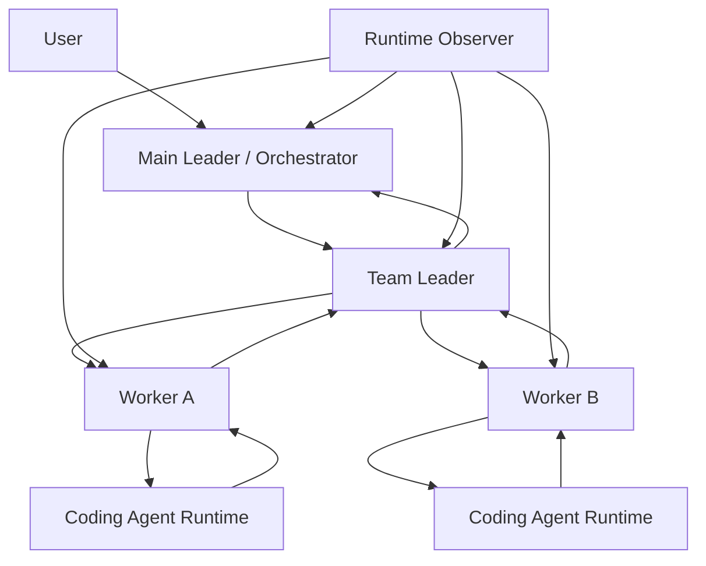

# Multi-Level Task Callback System Design

**Date:** 2026-04-06  
**Status:** Proposed design  
**Repository:** ClawTeam-OpenClaw  
**Scope:** Formal task contracts, worker/team/main-leader callback closure, durable state, and failure auto-reporting for persistent OpenClaw-backed teams

## 1. Problem Statement

The current system can spawn persistent teams and workers, but it does not yet behave like a closed-loop orchestration system.

Current gaps:

- worker completion is not the same as team completion
- team leader completion is not durably reported to main leader/orchestrator
- failures often depend on the failing worker being able to self-report
- natural-language prompt behavior is too permissive and underspecified
- research tasks and coding-runtime-backed tasks are not strongly distinguished
- tmux remains too important as the only trustworthy debugging surface in bad states

This means the current system is usable as a human-assisted multi-agent tool, but not yet trustworthy as a self-closing, self-reporting team runtime.

## 2. Design Goal

Turn the current stack into a real multi-level execution system with explicit contracts and durable callback closure.

Target behavior:

1. main leader accepts user mission
2. main leader creates or reuses a team
3. team leader receives a formal team contract
4. workers receive formal worker contracts
5. workers execute and produce structured outputs
6. workers report to team leader through durable callback envelopes
7. team leader aggregates worker outputs into a team result
8. team leader reports to main leader through a team-level callback envelope
9. any failure at worker or leader level is durably surfaced and reported upward

## 3. Core Principles

- `alive=true` is not the same as healthy
- `task completed` is not the same as `team completed`
- `worker message` is not the same as `team callback`
- `tmux text` is evidence, not authority
- every layer must have explicit input and output contracts
- failure reporting must not rely on the failing process still being able to run clawteam commands
- every meaningful state transition must be durable and inspectable from CLI/board

## 4. Layered Architecture

The system should be modeled as six logical layers:

1. user
2. main leader / orchestrator
3. team leader
4. worker
5. coding agent runtime
   - Claude
   - Codex
   - OpenClaw session-backed execution
6. runtime observer

Conceptual flow:



## 5. Required Contract Files

Introduce a formal file-based task contract layer.

These files are not optional documentation. They are execution contracts and audit artifacts.

### 5.1 `MISSION.md`

Owned by main leader.

Purpose:

- capture user objective
- define global scope
- define acceptance criteria
- define non-goals and constraints

Recommended structure:

```md
# Mission

## Goal
## Scope
## Non-Goals
## Constraints
## Deliverables
## Acceptance Criteria
## Priority
## Deadline / SLA
```

### 5.2 `TEAM_SPEC.md`

Owned by team leader.

Purpose:

- define why the team exists
- define team objective
- define role split and workstreams
- define team-level output contract
- define escalation rules

Recommended structure:

```md
# Team Spec

## Team Identity
- team_name
- leader
- created_by
- mission_ref

## Objective
## Role Breakdown
## Workstreams
## Input Artifacts
## Output Contract
## Escalation Rules
## Completion Rules
```

### 5.3 `WORKER_SPEC.md`

Owned by each worker.

Purpose:

- define the worker's exact objective
- define required inputs
- define execution policy
- define output contract
- define failure and escalation contract

Recommended structure:

```md
# Worker Spec

## Identity
- worker_name
- role
- team
- leader

## Objective
## Inputs
## Working Rules
## Execution Policy
## Required Process
## Output Contract
## Failure Contract
```

Mandatory detail fields should include:

- working directory
- target repo
- target branch
- worktree path when relevant
- whether coding runtime is required
- allowed providers
- self-test expectations
- required output files

### 5.4 `RESULT.md`

Owned by worker and team leader respectively.

Purpose:

- produce a structured, durable result artifact
- separate operator-facing summary from raw session transcript

Recommended structure:

```md
# Result

## Task
## Status
## Summary
## Work Performed
## Outputs
## Evidence
## Risks
## Self-Test
## Need Decision
## Recommended Next Step
```

### 5.5 `STATUS.json`

Machine-readable durable state file.

Purpose:

- expose worker/team/main-leader state transitions without scraping natural language
- support board, CLI, callbacks, and observers

Example worker-level shape:

```json
{
  "worker": "worker-docs",
  "task_id": "3399ca26",
  "state": "completed",
  "phase": "reported_to_leader",
  "spec_path": ".../WORKER_SPEC.md",
  "result_path": ".../RESULT.md",
  "workspace": "...",
  "branch": "...",
  "coding_jobs": [],
  "faults": [],
  "updated_at": "..."
}
```

## 6. Team Directory Layout

Recommended durable team layout:

```text
teams/<team_name>/
  MISSION.md
  TEAM_SPEC.md
  STATUS.json
  leader/
    LEADER_SPEC.md
    RESULT.md
    STATUS.json
  workers/
    worker-docs/
      WORKER_SPEC.md
      RESULT.md
      STATUS.json
      artifacts/
    worker-backend/
      WORKER_SPEC.md
      RESULT.md
      STATUS.json
      artifacts/
  callbacks/
    worker/
    leader/
    main/
  faults/
  logs/
```

For code-development tasks, add:

```text
  repos/
  workspaces/
```

## 7. Execution Policies

Each worker spec must declare the allowed execution mode.

At minimum support these policy classes:

### 7.1 `analysis_only`

Worker may complete the task directly without invoking coding runtime.

Still required:

- structured `RESULT.md`
- `STATUS.json`
- worker callback to team leader

### 7.2 `coding_runtime_required`

Worker must use `clawteam coding exec <provider>`.

Completion is not valid until:

- coding job exists
- callback report exists
- result artifacts exist
- worker result references the coding job

Suggested worker spec block:

```md
## Execution Policy
- direct_agent_execution: forbidden
- coding_runtime_required: true
- allowed_providers:
  - claude
  - codex
- callback_required: true
```

## 8. State Machines

### 8.1 Worker State Machine

```text
created
-> assigned
-> bootstrapping
-> ready
-> claimed
-> in_progress
-> waiting_coding_callback
-> synthesizing_result
-> reported_to_leader
-> completed

exception states:
-> blocked
-> failed
-> startup_failed
-> no_progress
```

Key rule:

- `completed` is not simply “worker says done”
- worker must at minimum reach `reported_to_leader`

### 8.2 Team Leader State Machine

```text
created
-> ready
-> dispatching
-> waiting_worker_reports
-> aggregating
-> reported_to_main_leader
-> completed

exception states:
-> blocked
-> failed
-> partial
```

Key rule:

- a team is not complete until team leader has produced a team-level result and callback

### 8.3 Main Leader State Machine

```text
accepted
-> planning
-> team_created
-> waiting_team_callback
-> evaluating_team_output
-> next_action_decided
-> completed

exception states:
-> blocked
-> escalated
-> failed
```

### 8.4 Coding Runtime State Machine

```text
queued
-> running
-> completed
-> callback_pending
-> callback_recorded
```

## 9. Multi-Level Callback Closure

This system requires three distinct callback layers.

### 9.1 Level 1: Coding Runtime -> Worker

The coding runtime returns results to the worker.

This layer already exists in V1 form.

Worker must classify the coding result as exactly one of:

- continue
- report_progress
- escalate
- complete
- blocked

### 9.2 Level 2: Worker -> Team Leader

Worker completion must not stop at a natural-language inbox sentence.

Required worker completion contract:

1. write `RESULT.md`
2. update `STATUS.json`
3. emit a structured worker callback envelope
4. optionally send a human-readable leader summary derived from the structured result

Recommended worker callback envelope:

```json
{
  "kind": "worker_callback",
  "version": 1,
  "team": "team-a",
  "worker": "worker-docs",
  "task_id": "3399ca26",
  "state": "completed",
  "phase": "reported_to_leader",
  "result_path": "teams/team-a/workers/worker-docs/RESULT.md",
  "status_path": "teams/team-a/workers/worker-docs/STATUS.json",
  "coding_jobs": [],
  "faults": [],
  "summary": "..."
}
```

### 9.3 Level 3: Team Leader -> Main Leader

This layer is currently missing and is required.

Required team-leader completion contract:

1. collect all worker callbacks
2. read worker results and statuses
3. aggregate into team-level result
4. write `leader/RESULT.md`
5. update team `STATUS.json`
6. emit a structured team callback envelope to main leader

Recommended team callback envelope:

```json
{
  "kind": "team_callback",
  "version": 1,
  "team": "team-a",
  "leader": "leader",
  "state": "completed",
  "team_result_path": "teams/team-a/leader/RESULT.md",
  "team_status_path": "teams/team-a/STATUS.json",
  "worker_summary": {
    "completed": 2,
    "blocked": 0,
    "failed": 0
  },
  "faults": [],
  "summary": "..."
}
```

Main leader should treat this team-level callback as the authoritative signal that the team has produced a meaningful result.

## 10. Failure Auto-Report Layer

Failures cannot depend on the failed actor being able to self-report.

Introduce runtime observers at three levels.

### 10.1 Worker Failure Observer

Detect:

- spawn success but first protocol step fails
- session alive but no task claim
- task claim without progress
- coding completion without callback
- worker runtime crash

Actions:

- write durable runtime fault
- update worker `STATUS.json`
- synthesize `failure_callback`
- notify team leader
- if team leader unavailable, escalate to main leader

### 10.2 Team Leader Failure Observer

Detect:

- leader session crash
- leader never dispatches
- workers complete but leader never aggregates
- leader never reports back to main leader

Actions:

- write durable leader fault
- update leader/team status
- synthesize leader failure callback
- escalate directly to main leader/orchestrator

### 10.3 Team No-Progress Observer

Detect:

- team stalls despite alive sessions
- worker callbacks missing for too long
- worker results exist but no team callback
- tasks remain pending while workers are alive and silent

Actions:

- write team-level runtime fault
- mark team status as stalled/partial/faulted
- notify main leader

## 11. Failure Callback Envelope

Recommended synthesized failure callback shape:

```json
{
  "kind": "failure_callback",
  "version": 1,
  "scope": "worker",
  "team": "team-a",
  "agent": "worker-docs",
  "fault_type": "worker_bootstrap_failed",
  "phase": "bootstrap",
  "detail": "...",
  "evidence": "...",
  "suggested_action": "respawn"
}
```

This callback must be durable and visible even if native messaging delivery later fails.

## 12. Main Leader Control Loop

Main leader must stop behaving as a fire-and-forget spawner.

Required governance loop:

1. create or attach team
2. wait for team callback
3. if timeout, inspect team status, faults, worker callbacks, and progress
4. decide one of:
   - retry
   - respawn
   - reassign
   - request clarification
   - escalate
   - terminate

Main leader must rely on durable control-plane surfaces, not tmux, as its authority model.

## 13. Message Protocol Rules

Natural-language summaries may remain, but they are not sufficient.

Every layer must emit structured callback envelopes.

Natural-language inbox messages should be treated as:

- human convenience surfaces
- operator-readable summaries
- secondary artifacts

Not authority.

## 14. Board and CLI Requirements

Board and CLI must render the multi-level closure state clearly.

Required board/CLI sections:

- waiting worker callbacks
- waiting team callback
- worker startup failures
- leader failures
- no-progress/stalled teams
- team aggregate completion state

Board should make it obvious that:

- worker completed is not the same as team completed
- team completed is not the same as main leader acknowledged

## 15. Implementation Phases

### Phase 1: Contract Layer

Implement:

- `MISSION.md`
- `TEAM_SPEC.md`
- `WORKER_SPEC.md`
- `RESULT.md`
- `STATUS.json`
- durable directory layout

### Phase 2: Callback Closure Layer

Implement:

- worker callback envelope
- team callback envelope
- main leader waits on team callback
- worker inbox no longer treated as final authority

### Phase 3: Failure Observer Layer

Implement:

- worker startup/runtime observer
- leader observer
- synthesized failure callbacks
- board/CLI fault rendering

### Phase 4: Execution Policy Layer

Implement:

- `analysis_only` vs `coding_runtime_required`
- stronger callback requirements for coding-runtime-backed tasks
- policy-based enforcement and validation

## 16. Acceptance Criteria

This design should be considered successfully implemented only when all of the following are true:

- every team has explicit mission/team/worker contract files
- every worker produces structured result and status artifacts
- worker completion flows durably to team leader via structured callback
- team leader completion flows durably to main leader via structured callback
- worker or leader failure becomes visible without opening tmux
- main leader can distinguish `worker complete`, `team complete`, and `mission complete`
- coding-runtime-required tasks cannot be silently completed without coding job/callback artifacts

## 17. Why This Is Required

Without this design, the system remains a useful multi-agent tool but not a trustworthy closed-loop runtime.

The missing ingredients today are not merely bugs. They are missing system semantics:

- formal task contracts
- multi-level callback closure
- durable failure auto-reporting
- main leader governance loop

Those semantics must exist before the system can be trusted as a professional, reliable team execution platform.
