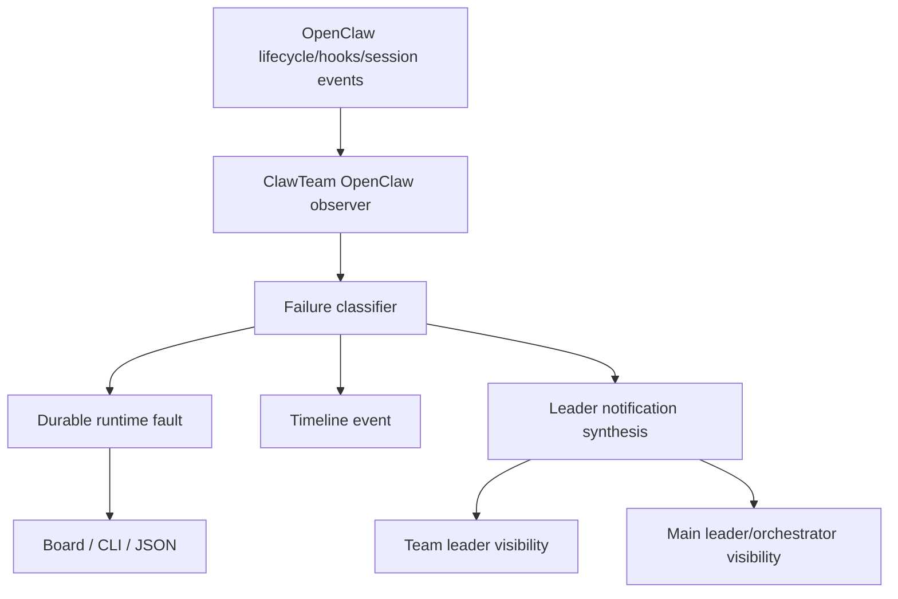

# OpenClaw Native Failure Reporting Integration Design

**Date:** 2026-04-06  
**Status:** Proposed design  
**Repository:** ClawTeam-OpenClaw  
**Scope:** Use OpenClaw native lifecycle, hook, and session communication capabilities to support worker/leader failure auto-reporting in ClawTeam-OpenClaw

## 1. Goal

Define how ClawTeam-OpenClaw should integrate with OpenClaw's native runtime capabilities so that worker and team-leader failures can be detected and surfaced automatically without relying only on tmux inspection or worker self-reporting.

This design answers:

- what OpenClaw already supports natively
- what ClawTeam-OpenClaw should consume from OpenClaw
- what business-layer logic still belongs to ClawTeam
- how worker failure should reach team leader and main leader/orchestrator

## 2. Executive Summary

OpenClaw already provides useful primitives:

- agent/session lifecycle observation
- plugin/gateway hook points
- cross-session messaging
- spawned sub-agent management

However, OpenClaw does not by itself provide the exact business semantics ClawTeam needs, such as:

- `worker_bootstrap_failed`
- `worker_startup_stalled`
- `team leader failed, escalate to main leader`
- durable fault records aligned with task/job/callback state

Therefore the correct architecture is:

- use OpenClaw native primitives for signal collection and delivery
- keep ClawTeam as the authority for team/task/runtime fault semantics
- synthesize durable ClawTeam failure records and leader-visible notifications from OpenClaw events

## 3. What OpenClaw Natively Supports

### 3.1 Lifecycle Stream and Run Outcome

OpenClaw agent loop supports lifecycle observation for runs.

Relevant semantics include:

- lifecycle stages such as `start`, `end`, and `error`
- wait semantics that distinguish `ok`, `error`, and `timeout`

This means OpenClaw can already tell us that an agent/session run ended in error or timed out.

### 3.2 Hooks

OpenClaw supports gateway/plugin hooks around important runtime events.

Relevant hook opportunities include:

- `agent_end`
- `session_start`
- `session_end`
- `message_received`
- `message_sent`
- `before_tool_call`
- `after_tool_call`

These hooks are the natural integration points for ClawTeam-side failure detection and derived reporting.

### 3.3 Session Ownership and History

OpenClaw sessions are gateway-owned and can be inspected through supported session mechanisms.

This gives us access to:

- session identity
- transcript/history access
- status information

### 3.4 Cross-Session Communication

OpenClaw provides native session tools such as:

- `sessions_send`
- `sessions_spawn`
- `sessions_history`
- `sessions_list`
- `session_status`
- `subagents`

This is critical because it means OpenClaw can send structured messages between sessions directly.

Therefore agent-to-agent and worker-to-leader communication is possible at the OpenClaw layer.

## 4. What OpenClaw Does Not Natively Give Us

OpenClaw primitives are not the same as ClawTeam business semantics.

OpenClaw does not inherently know:

- which failure should become a ClawTeam runtime fault
- whether a failed session corresponds to a worker bootstrap failure or a task-level block
- whether to notify team leader or main leader
- how to align failure with ClawTeam task/job/callback state
- how to keep board/CLI durable truth coherent

So OpenClaw native support is necessary but not sufficient.

## 5. Responsibility Split

### 5.1 OpenClaw Responsibility

OpenClaw should be used as the provider of:

- lifecycle signals
- hook callbacks
- session identifiers
- session-to-session communication
- spawned sub-agent control

### 5.2 ClawTeam Responsibility

ClawTeam remains the authority for:

- team topology
- leader/worker roles
- task ownership and business status
- coding job and callback semantics
- runtime fault durability
- board and CLI operator surfaces
- escalation policy from worker -> team leader -> main leader

## 6. Integration Objective

The integration should convert OpenClaw-native runtime events into ClawTeam-native durable fault and notification events.

Conceptually:

## 7. Integration Inputs From OpenClaw

ClawTeam should consume the following OpenClaw-native inputs when available.

### 7.1 Session Start

Used to record:

- worker or leader runtime became active
- session id linkage
- initial start timestamp

### 7.2 Session End

Used to record:

- worker or leader runtime exited
- end timestamp
- whether the exit happened before task claim, during task execution, or after callback

### 7.3 Agent End / Agent Error

Used to record:

- error termination
- timeout-like failure
- non-success exit semantics

### 7.4 Tool Call Failures

`before_tool_call` and `after_tool_call` can help capture cases like:

- command denied by allowlist
- command invocation errors
- execution wrapper failures
- clawteam CLI bootstrap failures

### 7.5 Session-to-Session Delivery

Use `sessions_send` to communicate structured failure summaries between:

- worker session -> team leader session
- team leader session -> main leader/orchestrator session

This is useful when the session is still alive enough for OpenClaw-native messaging, even if clawteam CLI in the worker environment is degraded.

## 8. Integration Outputs Into ClawTeam

These are the ClawTeam-native outputs the observer must create.

### 8.1 Durable Runtime Fault

Examples:

- `worker_bootstrap_failed`
- `worker_bootstrap_command_failed`
- `worker_startup_stalled`
- `worker_runtime_crashed`
- `leader_bootstrap_failed`
- `leader_runtime_crashed`

### 8.2 Timeline Event

Examples:

- `worker_bootstrap_failed`
- `worker_startup_stalled`
- `worker_runtime_crashed`
- `leader_runtime_crashed`
- `worker_failure_reported_to_leader`
- `leader_failure_reported_to_main_leader`

### 8.3 Synthesized Leader Notification

This should be leader-visible and derived from durable fault truth.

Possible channels:

- ClawTeam inbox message with explicit system source such as `runtime-observer`
- main leader summary feed
- board-visible alert item

## 9. Failure Classification Model

The integration layer should classify OpenClaw-native events into ClawTeam-native fault categories.

### 9.1 Worker Bootstrap Failure

Trigger examples:

- OpenClaw session starts
- first protocol command fails immediately
- tool-call error shows command bootstrap failure
- no task claim occurs in startup window

Classify as:

- `worker_bootstrap_failed`
- or more specifically `worker_bootstrap_command_failed`

### 9.2 Worker Startup Stalled

Trigger examples:

- session alive
- no task claim
- no inbox
- no coding job
- no callback
- no progress within threshold

Classify as:

- `worker_startup_stalled`
- or `worker_no_task_claim_after_spawn`

### 9.3 Worker Runtime Crash

Trigger examples:

- session end or error after task claim
- related task/job state still incomplete

Classify as:

- `worker_runtime_crashed`

### 9.4 Leader Failure

Trigger examples:

- team leader session ends or errors unexpectedly
- no orchestration progress and leader runtime terminated

Classify as:

- `leader_bootstrap_failed`
- or `leader_runtime_crashed`

## 10. Notification Routing Model

### 10.1 Worker Failure -> Team Leader

Preferred routing order:

1. durable runtime fault written by observer
2. timeline event written
3. synthesized team-leader-visible notification created
4. optional OpenClaw native `sessions_send` if direct team leader session binding is known

### 10.2 Team Leader Failure -> Main Leader / Orchestrator

Preferred routing order:

1. durable runtime fault written by observer
2. timeline event written
3. synthesized main-leader-visible notification created
4. optional OpenClaw native `sessions_send` to main leader session if available

### 10.3 If OpenClaw Native Session Messaging Fails

The failure must still be represented durably.

Meaning:

- session messaging is a transport optimization
- durable fault store remains authority
- board/CLI must still show the failure even if native message routing fails

## 11. Why ClawTeam Inbox Alone Is Not Enough

Current ClawTeam inbox reporting depends on the worker successfully executing clawteam commands.

This is insufficient for failures such as:

- bad command bootstrap
- allowlist denial
- missing clawteam executable path
- worker runtime failure before inbox send

Therefore the system needs a layer that can report failures even when `clawteam inbox send ...` cannot run inside the worker runtime.

OpenClaw native session events and hooks are the right source for this externalized reporting path.

## 12. V1 Integration Strategy

### Phase 1: Read-Only Signal Bridging

Implement:

- capture OpenClaw session start/end/error signals where possible
- map them into ClawTeam runtime faults
- expose via CLI/board/timeline

This phase does not require native message routing yet.

### Phase 2: Native Leader Notification Bridging

Implement:

- use OpenClaw-native session communication to send a structured failure summary to team leader session when possible
- if team leader fails, escalate to main leader/orchestrator session when possible
- record whether native notification delivery succeeded or failed

### Phase 3: Tight Team-State Correlation

Implement:

- correlate OpenClaw session failure with task/job/callback state
- distinguish bootstrap failure vs runtime failure vs callback-missing aftermath
- attach structured evidence and suggested operator action

## 13. Recommended V1 Deliverables

A realistic first implementation should include:

- OpenClaw observer component or hook bridge
- failure classifier
- durable runtime fault emission
- timeline emission
- synthesized leader notification in ClawTeam durable state
- board/CLI rendering of these new failure types

Optional but desirable in the same phase:

- OpenClaw native `sessions_send` bridge to leader session

## 14. Data Requirements

To make this viable, ClawTeam should preserve or associate:

- team name
- agent logical name
- agent role (`leader` or `worker`)
- OpenClaw session id
- tmux target if present
- task id if already known
- coding job id if already known
- error excerpt / pane excerpt / event text

These linkage fields are necessary for accurate durable fault synthesis.

## 15. Operator Surface Requirements

After implementation, operator-facing surfaces must support:

- seeing that a worker failed even if the task is still `pending`
- seeing that a leader failed even if some worker sessions are still alive
- seeing whether native session notification succeeded
- seeing evidence without opening tmux first

Board should surface:

- startup failures
- runtime crashes
- stalled sessions
- leader failure alerts

CLI should surface:

- fault list
- fault details
- timeline entries
- notification delivery outcome if tracked

## 16. Acceptance Criteria

This integration should be considered successful only when:

- OpenClaw-native lifecycle/hook/session signals are consumed where available
- worker bootstrap failure becomes durable ClawTeam fault state
- worker runtime crash becomes durable ClawTeam fault state
- team leader failure becomes visible to main leader/orchestrator
- tmux is no longer required as the primary fault-discovery path
- failure visibility survives even if native OpenClaw session messaging fails

## 17. Relationship To Other Designs

This document complements:

- worker/leader failure auto-report design
- runtime reconciliation/recovery design

Relationship:

- this document explains how to use OpenClaw-native capabilities as signal sources and optional transport
- worker/leader failure auto-report design defines the ClawTeam-native failure semantics
- reconciliation/recovery design defines what repair and re-delivery semantics come later

## 18. Practical Recommendation

Implementation should not wait for perfect OpenClaw-native integration.

Best pragmatic sequence:

1. build ClawTeam durable failure observer first
2. use tmux/pane/progress watchdogs as immediate signal sources
3. then bridge in OpenClaw lifecycle/hook/session signals as a richer signal layer
4. then add native session-to-session failure notification as an optimization

This avoids blocking observability on upstream integration depth while still taking full advantage of OpenClaw where available.
