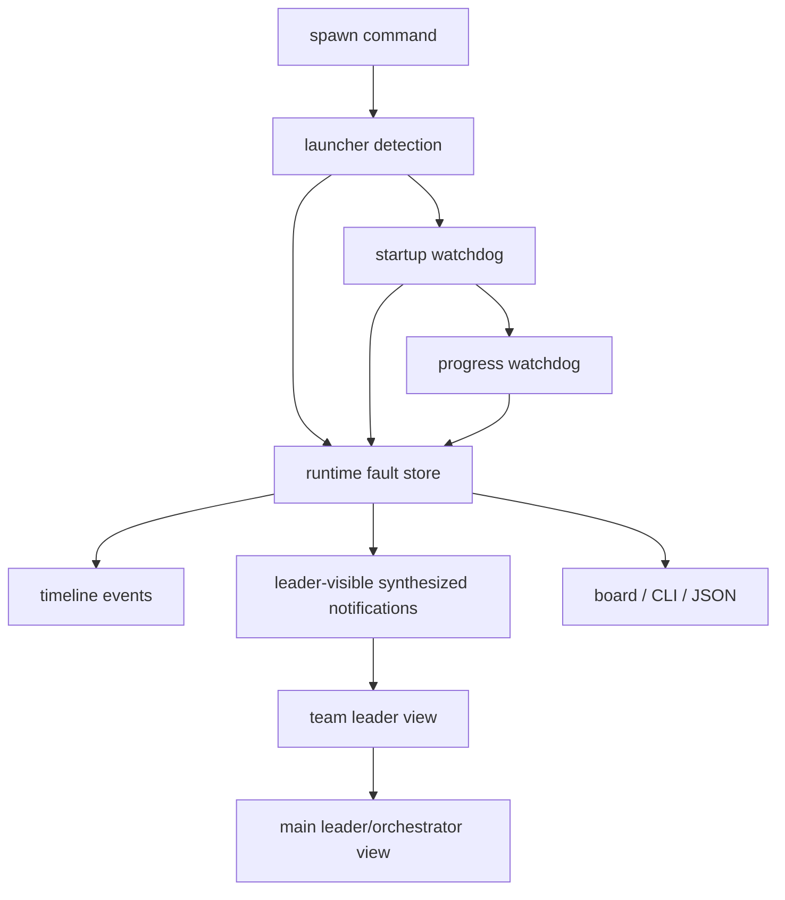

# Worker / Leader Failure Auto-Report Design

**Date:** 2026-04-06  
**Status:** Proposed design for next implementation phase  
**Repository:** ClawTeam-OpenClaw  
**Scope:** Automatic detection, durable faulting, and leader-visible reporting for worker and team-leader startup/runtime failures

## 1. Goal

Design a professional failure-reporting layer so that worker and team-leader failures become observable through the ClawTeam control plane without requiring an operator to manually open tmux panes.

The target outcome is:

- worker startup failure is durably visible
- worker runtime failure is durably visible
- team-leader failure is durably visible
- the main leader/orchestrator can observe these failures through CLI/board/state
- tmux remains a debugging surface, not the primary fault-discovery surface

This design explicitly covers failures where the worker cannot self-report because the very command path used for self-reporting is unavailable.

## 2. Problem Statement

Current behavior is insufficiently observable in real OpenClaw-driven runs.

A representative failure looked like this:

- team created successfully
- worker processes spawned successfully
- tmux windows existed
- workers were `alive=true`
- tasks remained `pending`
- no jobs, callbacks, sessions, or timeline activity appeared
- failure was visible only inside tmux pane text

The underlying problem was:

- the worker did start reading the injected prompt
- the worker attempted the first clawteam command
- the command bootstrap failed before task claim or inbox report
- because the reporting path itself depended on the failing command path, no structured report reached leader or board surfaces

This is not acceptable for a reliable, professional system.

## 3. Design Principles

- keep `task`, `coding job`, `provider session`, `callback`, and `fault` as separate truths
- do not use tmux pane text as the authority model
- do not automatically translate every worker failure into `task=blocked`
- `alive=true` must not be treated as equivalent to `healthy`
- failure reporting must not depend on the same broken path that caused the failure
- durable fault state must be the source of truth
- leader-visible notifications should be synthesized from durable fault truth, not improvised from tmux scraping alone

## 4. Non-Goals

This design does not introduce:

- detached async callback delivery
- provider config orchestration
- automatic fabrication of worker intent
- automatic task completion on failure
- board-only hidden state
- silent self-healing that overwrites authority boundaries

## 5. Failure Classes To Cover

### 5.1 Worker Bootstrap Failure

Examples:

- required clawteam command path unavailable
- prompt-driven first command fails immediately
- allowlist/exec command denied
- startup shell expands to invalid command
- OpenClaw runtime starts but first protocol action fails

### 5.2 Worker Startup Stalled

Examples:

- worker session exists and is alive
- no task claim occurs
- no inbox activity occurs
- no coding job begins
- no callback appears
- pane text suggests idle or partial prompt processing only

### 5.3 Worker Runtime Crash

Examples:

- worker claimed task and later exited unexpectedly
- worker was active but failed before final callback/reporting
- worker process exited while related task/job state remained incomplete

### 5.4 Team Leader Bootstrap Failure

Examples:

- leader runtime session fails to start
- leader cannot execute its own first clawteam coordination command
- leader pane shows startup error before orchestration begins

### 5.5 Team Leader Runtime Failure

Examples:

- leader process dies while workers remain active
- leader can no longer coordinate inbox/task/job state
- team remains partially alive but lacks functioning coordinator

### 5.6 Callback Missing After Terminal Job

Examples:

- coding job completed
- no callback report recorded
- task metadata remains stale or incomplete
- worker may already have crashed or exited

## 6. Architecture Overview

Introduce four cooperating layers:

1. launcher detection
2. startup watchdog
3. progress watchdog
4. auto-report synthesizer

Conceptual flow:



The key requirement is that detection and auto-reporting happen outside the failing worker command path.

## 7. Authority Model

### 7.1 Task

`task` remains the business work item.

Authority:

- owner, status, dependency graph, and task metadata come from persisted task files
- task state must not be rewritten solely from tmux text
- task `pending` may coexist with runtime failure facts

### 7.2 Coding Job

`coding job` remains the authoritative provider-execution record.

Authority:

- job state reflects provider execution truth
- job state is not inferred from worker pane output alone

### 7.3 Provider Session

`provider session` remains the runtime-console model for provider linkage.

Authority:

- session may be missing, ephemeral, or unavailable
- session truth does not override job truth

### 7.4 Callback Report

`callback report` remains authoritative only once durably persisted.

Authority:

- callback is distinct from job completion
- missing callback is a fault/reconciliation candidate, not implied success

### 7.5 Runtime Fault

`runtime fault` becomes the authoritative record of detected startup/runtime degradation.

Authority:

- startup failure
- stalled runtime
- crash
- callback missing
- routing/protocol mismatch

## 8. New Fault Types

Add or standardize these runtime fault types:

- `worker_bootstrap_failed`
- `worker_bootstrap_command_failed`
- `worker_startup_stalled`
- `worker_no_task_claim_after_spawn`
- `worker_runtime_crashed`
- `worker_progress_timeout`
- `leader_bootstrap_failed`
- `leader_runtime_crashed`
- `callback_missing_after_terminal_job`
- `session_alive_but_control_plane_silent`

## 9. Runtime Fault Schema Requirements

Recommended runtime fault fields:

- `faultId`
- `teamName`
- `agentName`
- `agentRole`
  - `leader`
  - `worker`
- `faultType`
- `severity`
- `status`
  - `open`
  - `acknowledged`
  - `resolved`
- `phase`
  - `spawn`
  - `bootstrap`
  - `startup`
  - `task_claim`
  - `coding`
  - `callback`
  - `reporting`
- `message`
- `detail`
- `evidence`
  - pane excerpt
  - exit code
  - session id
  - tmux target
  - missing-progress facts
- `detectedBy`
  - `launcher`
  - `startup_watchdog`
  - `progress_watchdog`
  - `exit_hook`
- `reportedToLeader`
- `reportedToMainLeader`
- `createdAt`
- `updatedAt`

## 10. Detection Layers

### 10.1 Launcher Detection

This layer runs immediately after spawn.

It checks:

- tmux session/window creation success
- pane existence
- command immediate exit
- OpenClaw runtime basic readiness

If launch itself fails, write a fault immediately.

Typical faults:

- `worker_bootstrap_failed`
- `leader_bootstrap_failed`

### 10.2 Startup Watchdog

This layer watches a newly spawned leader/worker for a bounded startup window, for example 20 to 60 seconds.

Signals to inspect:

- task claim appeared
- inbox message appeared
- coding job appeared
- callback appeared
- runtime timeline activity appeared
- pane/log contains explicit failure text

If the process is alive but none of the expected startup progress signals appear, the system should emit one of:

- `worker_startup_stalled`
- `worker_bootstrap_command_failed`
- `worker_no_task_claim_after_spawn`

The same pattern applies to team leader startup.

### 10.3 Progress Watchdog

This layer handles post-startup silence or interruption.

Examples:

- task claimed but no job starts within threshold
- job completed but callback missing after threshold
- session alive but no timeline/inbox/task progress for a long period
- worker exits while task remains incomplete

Typical faults:

- `worker_progress_timeout`
- `worker_runtime_crashed`
- `callback_missing_after_terminal_job`
- `session_alive_but_control_plane_silent`

### 10.4 Exit-Hook Detection

When worker or leader exits:

- capture exit moment
- check phase/state at exit time
- if no successful completion path is visible, emit corresponding failure fault

This is especially useful for:

- leader dies while workers remain alive
- worker dies after claiming task but before callback/reporting

## 11. Failure Reporting Model

### 11.1 Worker Failure -> Team Leader

When a worker fault is detected:

1. write durable runtime fault
2. append timeline event
3. synthesize a leader-visible notification

This synthesized notification must not pretend to be authored by the worker if the worker never successfully self-reported.

Recommended source identity:

- `runtime-observer`
- or similar explicit system actor

### 11.2 Team Leader Failure -> Main Leader / Orchestrator

If the team leader itself fails, do not route the failure only into that team leader's own inbox.

Instead:

1. write durable runtime fault
2. append timeline event
3. expose the failure through main leader/orchestrator-visible surfaces

### 11.3 Team Aggregation

Team leader should eventually expose an aggregate failure summary for its workers:

- healthy workers
- startup-failed workers
- stalled workers
- callback-missing workers
- crashed workers

This summary should be readable from board/CLI without manual tmux inspection.

## 12. Notification Channels

Use all three channels together.

### 12.1 Durable Fault Store

Primary authority.

### 12.2 Timeline

Useful for sequencing and diagnosis.

Recommended new timeline events:

- `worker_bootstrap_failed`
- `worker_startup_stalled`
- `worker_runtime_crashed`
- `leader_bootstrap_failed`
- `leader_runtime_crashed`
- `worker_failure_reported_to_leader`
- `leader_failure_reported_to_main_leader`

### 12.3 Synthesized Leader Notification

A derived notification should be made visible to leader or orchestrator.

V1 implementation can use an automatically generated inbox message with explicit system source.

Example:

```text
Runtime observer detected worker bootstrap failure
team=demo-team
worker=worker-docs
phase=bootstrap
fault=worker_bootstrap_command_failed
error=/bin/bash: line 1: $CLAWTEAM_BIN: command not found
suggested_action=respawn after prompt/runtime fix
```

## 13. Task State Semantics

Do not automatically collapse runtime faults into task status.

Recommended rules:

- if worker never claimed task:
  - task may remain `pending`
  - emit runtime fault instead of forcing `blocked`
- if worker claimed task and later died:
  - task may remain `in_progress`
  - emit runtime fault
- if callback missing after terminal job:
  - keep task/job truth intact
  - emit fault instead of fabricating completion

Only leader/operator should decide whether to translate the runtime failure into a business-level `blocked` task state.

## 14. Tmux Role

Tmux remains valuable, but only as an evidence surface.

Tmux should be used for:

- debugging
- capturing evidence excerpts
- visual inspection during deep diagnosis

Tmux should not remain the primary or sole fault-discovery surface.

The system should mine pane excerpts into fault evidence, but fault truth must live in durable state.

## 15. Example: Current `$CLAWTEAM_BIN` Failure Under This Design

Current real-world failure:

- worker session alive
- worker reads prompt
- first command fails: `$CLAWTEAM_BIN: command not found`
- no task claim
- no inbox self-report
- no callback

Under this design, the system should produce:

### Runtime fault

- `faultType=worker_bootstrap_command_failed`
- `agentRole=worker`
- `agentName=worker-docs`
- `phase=bootstrap`
- `message=worker failed before first clawteam protocol action`
- `detail=/bin/bash: line 1: $CLAWTEAM_BIN: command not found`
- `evidence=<pane excerpt>`

### Timeline

- `worker_bootstrap_failed`

### Leader-visible synthesized notification

```text
Runtime observer detected worker bootstrap failure
team=oc-discord-research-v031-0406-220606
worker=worker-docs
phase=bootstrap
fault=worker_bootstrap_command_failed
error=/bin/bash: line 1: $CLAWTEAM_BIN: command not found
```

This lets operator, team leader, and main leader know what happened without opening tmux.

## 16. CLI and Board Requirements

### 16.1 CLI

Enhance or add views so operators can see startup/runtime failures clearly.

Required surface behavior:

- `clawteam faults list --team <team>` must show worker/leader startup failures clearly
- `clawteam board show <team>` must indicate that `alive=true` does not mean healthy
- timeline inspection must show worker/leader startup/runtime failure events

### 16.2 Board

Board should expose a visible runtime alerts area with items such as:

- startup failures
- leader failures
- stalled workers
- callback missing faults
- session alive but silent

Board should not require opening raw JSON to notice these conditions.

## 17. Automatic Actions vs Human Actions

The system may automatically:

- detect failure
- record fault
- record timeline event
- synthesize leader notification
- suggest operator action

The system should not automatically:

- fabricate callback decisions
- force task completion
- silently rewrite task state from tmux text
- assume worker intent after startup/runtime failure

Optional future automation:

- policy-driven respawn suggestion
- retry candidate marking
- leader-side reassignment recommendation

## 18. Minimal V1 Implementation Plan

### Phase 1

Implement:

- worker/leader startup watchdog
- durable runtime fault record creation
- timeline failure events
- synthesized leader notification
- CLI/board fault visibility for startup failures

### Phase 2

Implement:

- progress watchdog
- callback-missing watchdog
- team leader aggregate failure summary
- main leader/orchestrator aggregate visibility

### Phase 3

Implement:

- repair/retry/reconcile integration
- policy-driven restart and reassignment
- richer notification and acknowledgement workflows

## 19. Acceptance Criteria

This design should be considered successfully implemented only when all of the following are true:

- worker startup failure is visible without opening tmux
- worker runtime crash is visible without opening tmux
- team leader failure is visible without opening tmux
- `alive=true` with no progress produces an explicit fault, not a silent healthy-looking state
- board and CLI show the same failure truth
- task/job/session/callback/fault boundaries remain distinct and explainable
- fault notifications do not depend on the broken worker command path itself

## 20. Relationship To Reconciliation Design

This design complements, but does not replace, the runtime reconciliation/recovery design.

Relationship:

- this document covers failure detection and auto-reporting
- reconciliation design covers repair, re-delivery, late callback, duplicate callback, and operator repair semantics

Failure auto-reporting should land first because it creates the observability foundation reconciliation depends on.
